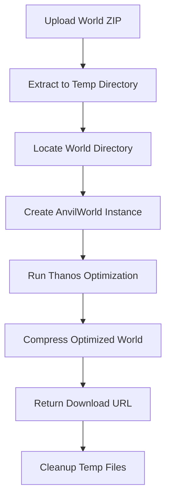

## Overview

MC World Compressor uses the [Thanos library](https://github.com/aternosorg/thanos) to reduce Minecraft world sizes by removing chunks that have never been inhabited. This process can significantly reduce world file sizes while preserving all player-built structures and explored areas.

## How Thanos Works

### Chunk Selection Algorithm

Thanos analyzes each chunk's `InhabitedTime` NBT tag:

- **InhabitedTime**: Measured in ticks (20 ticks = 1 second)
- **Default threshold**: Chunks with `InhabitedTime < 1` are removed
- **Result**: Only chunks where players have spent time are kept

From `app/Http/Controllers/API/CompressionController.php:158`:

```php
$thanos = new Thanos();

// Remove chunks with InhabitedTime = 0
$thanos->setMinInhabitedTime(1);

// Process the world
$removedChunks = $thanos->snap($world);
```

<Info>
The `snap()` method name is a reference to Thanos from Marvel Comics, who removed half of all life with a snap.
</Info>

### What Gets Removed?

<AccordionGroup>
  <Accordion title="Removed Chunks" icon="trash">
    - Chunks generated but never visited
    - Chunks briefly loaded but not explored
    - Spawn chunks with zero player activity
    - Naturally generated terrain far from bases
  </Accordion>
  
  <Accordion title="Preserved Chunks" icon="shield">
    - Player builds and structures
    - Explored caves and mines
    - Farm areas and redstone contraptions
    - Any chunk where a player has spent time
  </Accordion>
</AccordionGroup>

## Processing Flow

The compression process follows a three-stage pipeline:



### Stage 1: Extraction

From `app/Jobs/ProcesarMundoServidorJob.php:165`:

```php
if ($fileExtension === 'zip') {
    $zip = new ZipArchive;
    if ($zip->open($fullPathOriginalZip) !== TRUE) {
        throw new Exception("No se pudo abrir el archivo ZIP");
    }
    $zip->extractTo($this->extractionPath);
    $zip->close();
} elseif ($fileExtension === 'tar' || $fileExtension === 'tar.gz') {
    $phar = new PharData($fullPathOriginalZip);
    $phar->extractTo($this->extractionPath, null, true);
}
```

**Supported formats**:
- `.zip` - Standard ZIP archives
- `.tar` - TAR archives
- `.tar.gz` - Compressed TAR archives

### Stage 2: World Directory Detection

The system intelligently locates the world directory using `findWorldDirectory()` (`app/Http/Controllers/API/CompressionController.php:22`):

```php
private function findWorldDirectory(string $extractionPath): ?string
{
    // Case 1: level.dat in root
    if (File::exists($extractionPath . DIRECTORY_SEPARATOR . 'level.dat')) {
        return $extractionPath;
    }

    // Case 2: World in single subdirectory
    $items = File::directories($extractionPath);
    if (count($items) === 1) {
        $potentialWorldPath = $items[0];
        if (File::exists($potentialWorldPath . DIRECTORY_SEPARATOR . 'level.dat')) {
            return $potentialWorldPath;
        }
    }
    
    // Case 3: Search all first-level subdirectories
    foreach ($items as $dir) {
        if (File::exists($dir . DIRECTORY_SEPARATOR . 'level.dat')) {
            return $dir;
        }
    }

    return null;
}
```

This handles various ZIP structures:
- World files at root level
- World in a single folder
- Multiple folders with one containing the world

### Stage 3: Thanos Optimization

Two approaches are used:

#### Direct Library Call (Synchronous)

From `app/Http/Controllers/API/CompressionController.php:151`:

```php
$world = new AnvilWorld($worldSourcePath, $optimizedWorldPath);
$thanos = new Thanos();
$thanos->setMinInhabitedTime(1);
$removedChunks = $thanos->snap($world);
```

#### CLI Process (Asynchronous)

From `app/Jobs/ProcesarMundoServidorJob.php:185`:

```php
$thanosCommand = [
    'php',
    base_path('thanos/thanos.php'),
    $worldSourcePath,
    $this->optimizedWorldPath
];

$process = new Process($thanosCommand);
$process->setTimeout(null);
$process->setWorkingDirectory(base_path());
$process->run();

if (!$process->isSuccessful()) {
    throw new Exception("El proceso de Thanos falló: " . 
                        $process->getErrorOutput());
}
```

<Warning>
The CLI approach is used in background jobs to prevent PHP memory limits from affecting large worlds.
</Warning>

### Stage 4: Recompression

The optimized world is compressed into a new ZIP file (`app/Jobs/ProcesarMundoServidorJob.php:232`):

```php
$zipOutput = new ZipArchive();
if ($zipOutput->open($fullPathFinalOptimizedZip, 
                     ZipArchive::CREATE | ZipArchive::OVERWRITE) !== TRUE) {
    throw new Exception("No se pudo crear el archivo ZIP de salida");
}

$filesToZip = new \RecursiveIteratorIterator(
    new \RecursiveDirectoryIterator($this->optimizedWorldPath,
                                     \RecursiveDirectoryIterator::SKIP_DOTS),
    \RecursiveIteratorIterator::LEAVES_ONLY
);

foreach ($filesToZip as $name => $file) {
    if (!$file->isDir()) {
        $filePath = $file->getRealPath();
        $relativePathInOptimizedDir = substr($filePath, 
                                             strlen($this->optimizedWorldPath) + 1);
        $pathInZip = $outputZipRootFolderName . DIRECTORY_SEPARATOR . 
                     $relativePathInOptimizedDir;
        $zipOutput->addFile($filePath, $pathInZip);
    }
}

$zipOutput->close();
```

**Key features**:
- Preserves directory structure
- Maintains original world folder name
- Uses recursive iteration for all files

### Stage 5: Cleanup

Automatic cleanup in `finally` block (`app/Jobs/ProcesarMundoServidorJob.php:283`):

```php
if ($this->extractionPath && File::exists($this->extractionPath)) 
    File::deleteDirectory($this->extractionPath);
    
if ($this->optimizedWorldPath && File::exists($this->optimizedWorldPath)) 
    File::deleteDirectory($this->optimizedWorldPath);
```

This ensures temporary files are removed even if errors occur.

## Performance Characteristics

### Processing Time

From `app/Jobs/ProcesarMundoServidorJob.php:40`:

```php
public int $timeout = 300; // 5 minutes
```

Typical processing times:
- **Small worlds** (< 100MB): 30-60 seconds
- **Medium worlds** (100-500MB): 1-3 minutes
- **Large worlds** (500MB+): 3-5 minutes

### Compression Ratios

Actual results depend on world exploration:
- **Heavily explored**: 10-30% reduction
- **Moderately explored**: 40-60% reduction
- **Minimally explored**: 70-90% reduction

<Tip>
Worlds with large unexplored areas (like server spawn worlds) see the best compression ratios.
</Tip>

## Error Handling

### Validation Checks

Before processing (`app/Http/Controllers/API/CompressionController.php:146`):

```php
$worldSourcePath = $this->findWorldDirectory($extractionPath);
if (!$worldSourcePath) {
    throw new Exception("No se pudo encontrar el directorio del mundo");
}
```

After processing (`app/Http/Controllers/API/CompressionController.php:167`):

```php
if (!File::exists($optimizedWorldPath) || 
    count(File::allFiles($optimizedWorldPath)) === 0) {
    throw new Exception("La optimización con Thanos no produjo salida");
}
```

### Common Failure Scenarios

<CardGroup cols={2}>
  <Card title="Invalid ZIP" icon="file-zipper">
    - Corrupted archive
    - Unsupported compression
    - Incomplete upload
  </Card>
  
  <Card title="Missing level.dat" icon="folder-xmark">
    - Not a Minecraft world
    - Wrong directory structure
    - Incomplete extraction
  </Card>
  
  <Card title="Memory Limits" icon="memory">
    - World too large for sync
    - PHP memory exhausted
    - Use async job instead
  </Card>
  
  <Card title="Disk Space" icon="hard-drive">
    - Insufficient temp space
    - Storage quota exceeded
    - Cleanup not running
  </Card>
</CardGroup>

## Output Characteristics

### File Naming Convention

From `app/Jobs/ProcesarMundoServidorJob.php:138`:

```php
$finalOptimizedZipName = Str::slug($originalFileNameWithoutExt) . '_compressed.zip';
```

**Example**: `my-world_compressed.zip`

### Metadata Tracking

The system tracks compression results (`app/Jobs/ProcesarMundoServidorJob.php:253`):

```php
$this->servidor->tamano_final = $tamanoFinalEnMB;
$this->servidor->save();
```

This allows calculating compression ratio:
```php
$ratio = ($servidor->tamano_inicio - $servidor->tamano_final) / 
         $servidor->tamano_inicio * 100;
```

<Card title="Next Steps" icon="arrow-right">
Learn about the [job queue system](/concepts/job-queue) that manages background processing.
</Card>